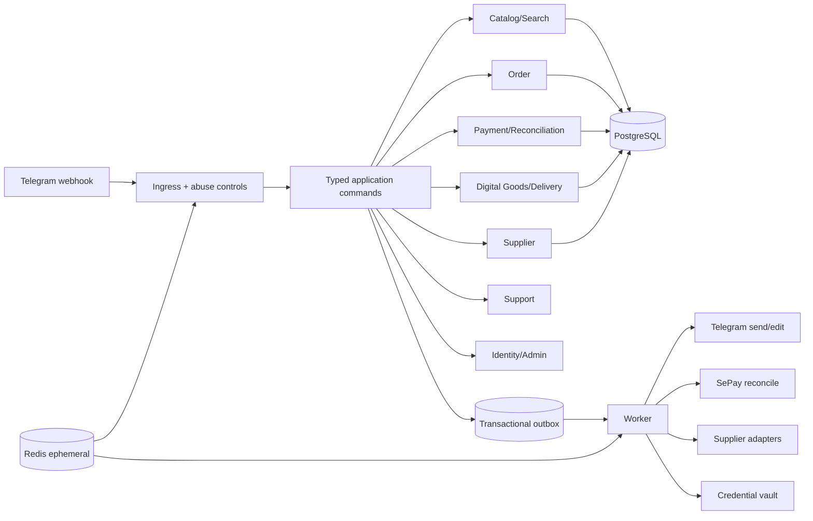

# Implementation Plan: Telegram Shop Digital MVP

**Branch**: `001-telegram-shop-mvp` | **Date**: 2026-07-16 | **Spec**: [feature specification](./SPEC_KIT_FEATURE_SPEC.md)

**Input**: Feature specification from `specs/001-telegram-shop-mvp/spec.md`

## Summary

Build one TypeScript modular monolith plus worker for the customer journey `catalog/search ->
Buy Now -> VietQR -> verified SePay evidence -> local/supplier fulfillment -> view-once delivery`.
PostgreSQL and a transactional outbox are authoritative. Telegram, VietQR, SePay, vault, and
supplier integrations remain adapters around typed application commands. The first implementation
ends at a limited retail pilot; wallet, top-up, Reseller API, multi-item cart, and growth features
remain separate future specifications.

## Technical Context

**Language/Version**: Node.js 24 LTS + TypeScript 5.x in strict mode

**Primary Dependencies**: Fastify 5, grammY 1, Zod 4, Kysely 0.29, Pino 10,
OpenTelemetry API 1; BullMQ 5 only where Redis-backed work is justified

**Storage**: PostgreSQL for all authoritative state; Redis for ephemeral rate limits/cache/job
coordination; object storage for shop-owned media; approved vault/secret manager for credentials

**Testing**: Vitest 4, Testcontainers 12, fast-check 4, adapter contract fixtures, acceptance tests
at Telegram-update and SePay-webhook seams

**Target Platform**: Containerized Linux deployment behind TLS; Telegram webhook ingress

**Project Type**: Single backend application with an independently runnable worker from one codebase

**Performance Goals**: p95 useful bot response under 1 second for cached catalog/navigation;
SePay webhook validation/persistence acknowledgement under 1 second; healthy-dependency paid-to-
delivery p95 under 60 seconds

**Constraints**: Integer VND; `vi-VN`; `Asia/Ho_Chi_Minh`; one variant per Order; no raw
credential outside vault/delivery reveal; exactly-once business effects over at-least-once delivery;
sole numeric Telegram root admin; no policy bypass

**Scale/Scope**: Limited pilot baseline of 1,000 daily active customers, 20 concurrent checkouts,
10,000 catalog variants, and burst replay of 100 identical provider events; tune only from measured load

## Constitution Check

*GATE: passed before Phase 0 and re-checked after Phase 1.*

| Gate | Status | Evidence |
|---|---|---|
| Customer-first retail scope | PASS | Spec Out of Scope; no wallet/cart/reseller surface |
| VietQR initiation + verified SePay truth | PASS | FR-008–FR-012; payment contract |
| Exactly-once settlement/supplier/allocation/delivery | PASS | FR-010, FR-014–FR-017; idempotency keys in data model/contracts |
| Vault-only secrets | PASS | SR-001; Digital Asset and Delivery Bundle model |
| Sole numeric admin | PASS | FR-021–FR-023; Telegram command contract |
| Explicit state machines | PASS | data-model.md covers all state owners and guards |
| Contract-first external adapters | PASS | contracts/telegram-ux.md, payment-sepay.md, supplier-port.md, delivery.md |
| Test-first recovery and reconciliation | PASS | quickstart.md plus task ordering requirement |
| Policy and resale launch gates | PASS | SR-007–SR-008; activation and readiness gates |
| Critical/High design findings | PASS WITH LAUNCH GATES | No unresolved design contradiction; production inputs remain explicit blockers |

### Post-design re-check

- Every external input has a validation, idempotency, timeout, error, and audit contract.
- No contract exposes raw credentials except the single-use authenticated reveal response.
- Database relationships preserve object ownership and unique business-effect keys.
- Recovery paths exist for missing webhooks, supplier unknown results, process crashes, and expired delivery.
- No constitution violation requires a complexity exception.

## Architecture



### Module ownership

| Module | Owns | Does not own |
|---|---|---|
| Identity/Admin | Customer/channel mapping, sole-admin policy, admin confirmations | Order/payment mutation |
| Catalog/Search | Category, Product, Variant, aliases, bounded search filters | Inventory claim, generated product facts |
| Commerce | Order snapshot and Order transitions | SePay verification, raw credential |
| Payments | Payment Intent, Bank Transaction, evidence, allocation, discrepancy, refund request | Fulfillment |
| Digital Goods | Asset lifecycle, reservation/claim, Delivery Bundle, replacement | Payment truth, supplier transport |
| Supplier | Supplier credential reference, SKU mapping, Supplier Order and reconciliation | Customer-facing facts, internal Order truth |
| Support | Ticket lifecycle and linked context | Mark-paid, direct refund, credential reveal |
| Risk/Ingress | Telegram/provider verification, dedupe, rate/body limits | Domain business decisions |
| Outbox/Worker | Reliable side-effect dispatch and retry/DLQ | Authoritative business state |

## Project Structure

### Documentation (this feature)

```text
specs/001-telegram-shop-mvp/
├── spec.md
├── plan.md
├── research.md
├── data-model.md
├── quickstart.md
├── contracts/
│   ├── application-commands.md
│   ├── delivery.md
│   ├── payment-sepay.md
│   ├── supplier-port.md
│   └── telegram-ux.md
├── checklists/
│   ├── requirements.md
│   ├── security.md
│   └── operations.md
├── analysis.md
└── tasks.md
```

### Source Code (repository root)

```text
src/
├── main.ts
├── worker.ts
├── config/
├── bot/
│   ├── webhook.ts
│   ├── callbacks.ts
│   ├── presenters/
│   └── middleware/
├── modules/
│   ├── identity/
│   ├── catalog/
│   ├── commerce/
│   ├── payments/
│   ├── digital-goods/
│   ├── supplier/
│   ├── support/
│   └── risk/
├── infrastructure/
│   ├── db/
│   ├── outbox/
│   ├── redis/
│   ├── vault/
│   └── observability/
└── shared/
    ├── errors/
    ├── ids/
    ├── money/
    └── time/

tests/
├── acceptance/
├── contract/
├── integration/
├── property/
├── security/
└── fixtures/
```

**Structure Decision**: One package and deployable codebase keeps transactions, ownership, and
operations simple. `main.ts` and `worker.ts` provide two process entrypoints without introducing
microservices. Each module exposes application commands/queries and owns its persistence mappings;
Telegram and provider adapters never import another module's persistence implementation.

## Delivery Phases

1. Walking skeleton: config, migrations, webhook ingress, command bus, outbox, observability.
2. Catalog/search: menu, category/product/variant read model, deterministic search, bounded parser.
3. Buy Now/payment: Order snapshot, VietQR presentation, SePay inbox, evidence and reconciliation.
4. Fulfillment: local asset claim, supplier port/unknown recovery, vault, Delivery Bundle.
5. Customer recovery: Order history, support, discrepancy, replacement/refund request.
6. Owner operations: sole-admin controls, catalog kill switch, audits and runbooks.
7. Hardening/pilot: concurrency/replay/security/load/restore drills, Critical/High closure, launch sign-off.

## Complexity Tracking

No constitution violation or speculative abstraction is accepted. Redis/BullMQ remains optional;
the first implementation may use PostgreSQL outbox polling alone if pilot measurements do not
justify a second runtime dependency.
