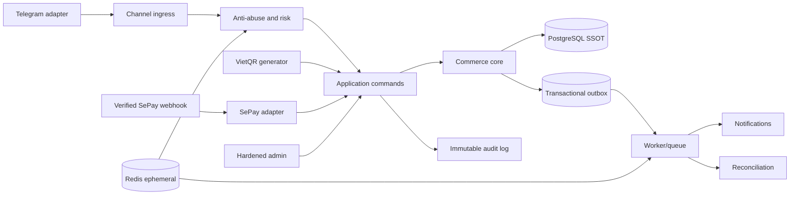
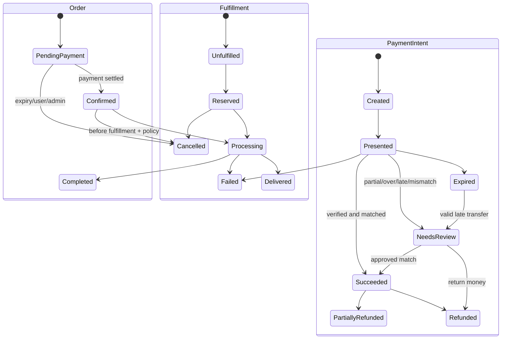
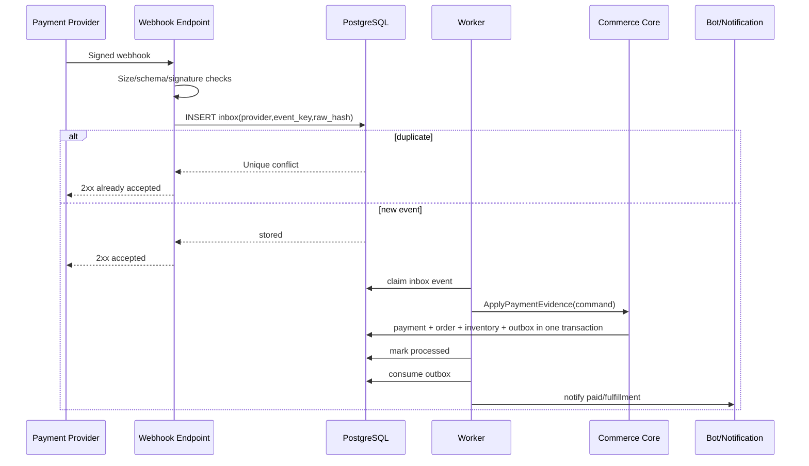

# Blueprint trước khi code: Telegram shop bán digital account

> Trạng thái: Bản nghiên cứu và đề xuất kiến trúc v0.1  
> Ngày đối chiếu nguồn: 2026-07-16  
> Phạm vi MVP: khách Việt tìm sản phẩm, mua ngay, thanh toán VietQR, SePay check/reconcile và nhận digital account/access được ủy quyền qua secure delivery. Supplier API là backend-only; Reseller API và wallet là post-MVP.  
> Chưa phải tư vấn pháp lý hoặc cam kết chứng nhận bảo mật.

Luồng khách hàng và copy màn hình chuẩn nằm tại [MVP Customer Flow](../docs/00-overview/MVP_CUSTOMER_FLOW.md); đặc tả nghiệp vụ nằm tại [FUNCTIONAL_SPEC.md](../docs/02-domain/FUNCTIONAL_SPEC.md).

## 1. Kết luận điều hành

MVP là một **shop tự động trong Telegram**, với commerce core giữ tính đúng đắn cho đơn hàng, tồn kho, thanh toán và giao hàng. Không xây một chatbot AI bán hàng tổng quát hoặc một commerce platform lớn trước khi happy path retail hoạt động.

Khuyến nghị mặc định:

1. **Modular monolith trước**, PostgreSQL là nguồn sự thật; Redis chỉ giữ rate limit, cache và job ngắn hạn.
2. **Payment core là VietQR + SePay.** VietQR tạo QR; SePay verify/check/reconcile transaction. QR, redirect, screenshot và chat không phải bằng chứng settled.
3. Tích hợp **SePay** qua payment adapter cho webhook/check/reconciliation; VietQR chỉ là QR generation adapter. Không dùng API ngân hàng không chính thức, không lưu user/password ngân hàng, không OCR ảnh biên lai để tự động giao hàng.
4. Tách riêng các vòng đời `Order`, `PaymentIntent`, `InventoryReservation`, `SupplierOrder`, `DeliveryBundle` và `Refund`. Retail MVP dùng `Buy Now`, không cần multi-item Cart.
5. Mọi webhook, callback bot và command đều phải **idempotent**, có khóa chống trùng và chịu được retry/sự kiện đến sai thứ tự.
6. Baseline bảo mật: **OWASP ASVS 5.0 Level 2**, cộng các control mạnh hơn cho payment/admin; threat model STRIDE; RBAC; audit bất biến; secret rotation; backup/restore diễn tập được.
7. AI/LLM chỉ parse câu tìm kiếm thành bounded filters. AI **không được tạo product facts, ghi DB, xác nhận thanh toán, giảm tồn, gọi supplier hay hoàn tiền**.
8. Bề mặt bot chỉ có `Danh sách sản phẩm`, `Tìm sản phẩm`, `Đơn hàng`, `Hỗ trợ`; không có wallet, top-up, reseller hoặc supplier controls.
9. Happy path là `catalog/search → Buy Now → VietQR → SePay → secure delivery`, đạt QR trong 3–4 lần bấm.
10. Wallet và Reseller API là post-MVP lanes riêng; không ảnh hưởng customer flow hoặc schema tối thiểu của retail walking skeleton.
11. Chỉ một root admin: numeric Telegram `user_id` được cấu hình cho `@Quyenvjp`; username chỉ là nhãn kiểm tra, không có `/add-admin`.
12. Account có thể lấy từ Supplier API nhưng chỉ từ nguồn được phép resale/transfer; supplier order idempotent, credential ở vault và giao qua one-time Delivery Bundle.
13. Telegram/provider policy risk được ghi riêng và là launch gate; không che giấu hoặc bypass policy bằng cách đổi tên payment flow.

Kênh đầu tiên được chốt là **Telegram** và product wedge là authorized digital account/access. Lõi vẫn giữ channel adapter để không khóa domain vào Telegram.

## 2. Bằng chứng từ repo và tài liệu chính thống

### 2.1 Repo nên học

| Repo/nguồn | Giá trị học hỏi | Không nên bê nguyên |
|---|---|---|
| [payOSHQ/payos-lib-node](https://github.com/payOSHQ/payos-lib-node) | SDK chính thức, tạo payment link, đăng ký webhook và `webhooks.verify()`, ký dữ liệu bằng checksum key. Đây là nguồn tham chiếu tốt cho adapter payOS. | Không để SDK lan vào domain; bọc trong adapter. Không coi callback redirect của browser/bot là kết quả thanh toán. |
| [vietqr/vietqr-node](https://github.com/vietqr/vietqr-node) | Tham khảo cách tạo QR/link từ bank, account, amount, memo và template. | Repo tạo QR không giải quyết xác nhận giao dịch, idempotency, đối soát hay vòng đời đơn hàng. |
| [vietqr/vietqr-gateway-examples](https://github.com/vietqr/vietqr-gateway-examples) | Ví dụ tích hợp VietQR Gateway đa nền tảng. | Chỉ dùng như ví dụ adapter/UI; không coi sample là security architecture. |
| [xuannghia/vietnam-qr-pay](https://github.com/xuannghia/vietnam-qr-pay) | Encode/decode VietQR, QR đa năng và VNPayQR; hữu ích cho test fixture và kiểm tra payload/CRC độc lập. | Không tự viết “payment gateway” chỉ từ QR encoder/decoder. |
| [kentzu213/telegram-shop-bot](https://github.com/kentzu213/telegram-shop-bot) | Repo gần bài toán nhất: bot Telegram, QR VietQR, stock, SQLite, Google Sheet; cấu trúc command/handler/service dễ đọc để học luồng UX. | Tại thời điểm kiểm tra repo chỉ có 4 commit và chưa có release. Google Sheet “publish to web”, SQLite và cấu hình đơn giản phù hợp demo, không phải nền production bảo mật cao. Không fork rồi deploy thẳng. |
| [vendure-ecommerce/vendure](https://github.com/vendure-ecommerce/vendure) | State machine tường minh cho order/payment; hook transition; module commerce trưởng thành. | Không cần mang cả nền tảng về cho một bot nhỏ. Học state/invariant, không copy độ phức tạp. |
| [medusajs/medusa](https://github.com/medusajs/medusa) | Phân module order/payment, workflow có bước bù/rollback, provider abstraction, return/exchange/claim. | Không triển khai tất cả module ngay từ MVP nếu sản phẩm chỉ có luồng bán đơn giản. |
| [saleor/saleor](https://github.com/saleor/saleor) | Payment orchestration, webhook HMAC, async/sync events, tách extension khỏi core. | Không chọn microservices chỉ vì Saleor có hệ sinh thái extension; modular monolith vẫn hợp lý hơn ở giai đoạn đầu. |
| [grammyjs/grammY](https://github.com/grammyjs/grammY) / [telegraf/telegraf](https://github.com/telegraf/telegraf) | Framework adapter Telegram trưởng thành; middleware, command/callback routing. | Không đặt business logic trong handler/middleware bot. Handler chỉ xác thực, normalize và gửi command vào application layer. |
| [chatwoot/chatwoot](https://github.com/chatwoot/chatwoot) | Conversation/inbox, phân quyền, audit và omnichannel support; hữu ích nếu cần agent hỗ trợ người thật. | Không kéo cả CRM/helpdesk vào payment core; tích hợp qua event/API khi thật sự cần. |
| [animir/node-rate-limiter-flexible](https://github.com/animir/node-rate-limiter-flexible) | Atomic counter, penalty/block và store Redis/Valkey/Postgres; phù hợp học anti-abuse đa instance. | Không dùng một limiter chung cho mọi hành vi và không dùng Redis counter làm sổ nghiệp vụ. |

### 2.2 Kết luận từ nguồn chính thức

- VietQR Quick Link có dạng `BANK_ID`, `ACCOUNT_NO`, `TEMPLATE`, `AMOUNT`, `DESCRIPTION`, `ACCOUNT_NAME`; tài liệu ghi rõ `ACCOUNT_NAME` chỉ để hiển thị trên ảnh, không nằm trong tiêu chuẩn mã VietQR. Vì vậy dữ liệu hiển thị trên ảnh không được dùng làm bằng chứng nhận tiền. Nguồn: [VietQR Quick Link](https://www.vietqr.io/danh-sach-api/link-tao-ma-nhanh/).
- payOS trả webhook có `orderCode`, `amount`, `reference`, `paymentLinkId`, thời gian giao dịch và `signature`; SDK chính thức có `webhooks.verify()`. Nguồn: [payOS API](https://payos.vn/docs/api/) và [hướng dẫn kiểm tra signature](https://payos.vn/docs/tich-hop-webhook/kiem-tra-du-lieu-voi-signature/).
- Hướng dẫn payOS tạo HMAC-SHA256 từ dữ liệu đã sắp xếp bằng `checksumKey`. Không tự biến tấu quy tắc canonicalization; dùng SDK chính thức và test bằng fixture của provider.
- SePay công bố webhook biến động số dư theo thời gian thực và API phục vụ đối soát. Nguồn: [SePay Developer](https://developer.sepay.vn/) và [SePay Webhooks](https://developer.sepay.vn/vi/sepay-webhooks).
- Tài liệu SePay yêu cầu HMAC-SHA256 trên chuỗi `timestamp.raw_body`, có header timestamp/signature, unique transaction ID, retry và khuyến nghị ack nhanh rồi đưa vào queue. Vì chữ ký phủ raw bytes, phải verify **trước khi parse rồi stringify lại**. Nguồn: [SePay webhook authentication](https://developer.sepay.vn/vi/sepay-webhooks/xac-thuc), [security](https://developer.sepay.vn/vi/sepay-webhooks/bao-mat), [error/retry](https://developer.sepay.vn/vi/sepay-webhooks/xu-ly-loi) và [reconciliation](https://developer.sepay.vn/vi/sepay-webhooks/doi-soat-giao-dich).
- Casso là nguồn tham khảo tốt cho webhook biến động số dư: transaction ID duy nhất, retry khi endpoint không ack, strict success response và reconciliation API. Nếu mục tiêu là payment link hoàn chỉnh, tài liệu Casso hướng sang payOS. Nguồn: [Casso Webhook V2](https://docs.casso.vn/tich-hop/webhook_v2) và [sample handler](https://github.com/CassoHQ/casso-webhook-handler-sample).
- Telegram retry webhook khi endpoint không trả 2xx và hỗ trợ `secret_token` qua header `X-Telegram-Bot-Api-Secret-Token`; do đó dedupe theo `update_id` là bắt buộc. Nguồn: [Telegram Bot API: setWebhook](https://core.telegram.org/bots/api#setwebhook).
- Vendure mô hình hóa order và payment bằng state machine độc lập; payment mặc định có các hướng `Created -> Authorized/Settled/Declined/Error/Cancelled`. Nguồn: [Vendure payment state machine](https://raw.githubusercontent.com/vendure-ecommerce/vendure/master/packages/core/src/service/helpers/payment-state-machine/payment-state-machine.ts) và [order state definitions](https://raw.githubusercontent.com/vendure-ecommerce/vendure/master/packages/core/src/service/helpers/order-state-machine/order-state.ts).
- Medusa tách Payment Collection, Payment Session, Payment, Capture, Refund và provider; order workflow có bước rollback. Nguồn: [Medusa Order Module](https://docs.medusajs.com/resources/commerce-modules/order) và [Payment Module](https://docs.medusajs.com/resources/commerce-modules/payment).
- Saleor dùng HMAC để xác thực và bảo toàn payload webhook, đồng thời tách webhook sync/async. Nguồn: [Saleor Webhooks](https://docs.saleor.io/developer/extending/webhooks/overview).
- OWASP API Security Top 10 2023 nhấn mạnh object authorization, authentication, resource consumption, inventory và unsafe consumption of APIs. Nguồn: [OWASP API Security Top 10 2023](https://owasp.org/API-Security/editions/2023/en/0x11-t10/).
- ASVS cung cấp bộ yêu cầu kiểm chứng control bảo mật cho web app; bản 5.0.0 được công bố tháng 5/2025. Nguồn: [OWASP ASVS](https://owasp.org/www-project-application-security-verification-standard/).

## 3. Ubiquitous language: từ vựng phải chốt

| Thuật ngữ chuẩn | Nghĩa nghiệp vụ | Không được hiểu là |
|---|---|---|
| Customer | Người mua; có thể ánh xạ một hoặc nhiều Channel Identity sau khi xác minh. | Telegram user ID hoặc số điện thoại riêng lẻ. |
| Channel Identity | Danh tính do Telegram/Zalo/web cấp, ví dụ `telegram:user_id`. | Customer đã KYC. |
| Cart | Tập lựa chọn có thể thay đổi, chưa tạo nghĩa vụ thanh toán. | Order. |
| Checkout | Snapshot bất biến của giá, hàng, phí và địa chỉ dùng để tạo Order. | Một màn hình UI. |
| Order | Cam kết mua bán đã snapshot line item/giá; không phụ thuộc catalog thay đổi sau đó. | Payment. |
| Payment Intent | Ý định thu đúng một tổng tiền cho một Order, có thời hạn và provider mapping. | QR image. |
| Payment Attempt | Một lần tạo link/QR hoặc thử thanh toán cụ thể tại provider. | Toàn bộ lịch sử payment. |
| Bank Transaction | Dòng tiền được provider/bank quan sát, có reference duy nhất. | Webhook request. |
| Payment Evidence | Dữ liệu provider đã xác minh chữ ký và được đối chiếu amount/order/reference. | Ảnh chụp biên lai hoặc nút “Tôi đã trả”. |
| Inventory Reservation | Giữ tạm số lượng cho checkout/order đến một thời điểm. | Trừ kho vĩnh viễn. |
| Fulfillment | Quá trình giao hàng/giao quyền truy cập sau khi order được phép thực hiện. | Payment success. |
| Reconciliation | So khớp sổ nội bộ với giao dịch provider/bank để phát hiện thiếu, trùng, lệch tiền. | Chạy lại webhook mù quáng. |
| Manual Review | Trạng thái buộc nhân viên xử lý do thiếu/thừa tiền, trả muộn, trùng nội dung hoặc dữ liệu mâu thuẫn. | Cho phép admin tự sửa DB. |

## 4. Kiến trúc mục tiêu

### 4.1 Lựa chọn triển khai

- Một deployable backend + một worker; có thể cùng codebase và cùng release.
- PostgreSQL là source of truth cho order, payment, stock, webhook inbox, outbox và audit.
- Redis không giữ dữ liệu mà mất đi sẽ làm sai tiền hoặc sai đơn.
- Object storage chỉ cho ảnh sản phẩm/tài liệu; không public PII.
- Provider và channel đi qua port/adapter. Domain không import SDK Telegram/VietQR/SePay.
- Không tách microservice trước khi có bằng chứng về tải, team ownership hoặc isolation requirement.

### 4.2 Module boundaries

| Module | Sở hữu dữ liệu | Được phép làm | Không được làm |
|---|---|---|---|
| Identity & Access | customer, channel identity, admin, role, session | Link identity, authenticate, authorize | Tạo order/payment |
| Channel Ingress | inbound update, dedupe key, normalized command | Verify channel secret, normalize input | Ghi trực tiếp order/stock |
| Catalog/Search | category, product, variant, alias, search index | Publish database-authoritative facts; parse bounded search filters | Để AI bịa product fact hoặc gọi domain command |
| Pricing | price list, promotion, quote | Tính quote bất biến | Đọc số tiền từ tin nhắn khách rồi tin luôn |
| Buy Now/Order | order, line snapshot, transition | Revalidate variant và tạo một Order | Tin giá/stock từ callback hoặc gọi SDK provider trực tiếp |
| Inventory | stock ledger, reservation | Reserve/commit/release atomically | Dựa vào cache để quyết định stock |
| Payment | intent, attempt, provider mapping, transaction | Tạo QR/link, verify/match payment | Giao hàng |
| Fulfillment | shipment/digital grant | Giao sau policy cho phép | Tự suy đoán payment |
| Digital Goods | account asset, entitlement, credential reference, delivery bundle | Reserve/validate/deliver authorized digital access exactly once | Lưu/gửi raw credential trong log/event/chat history |
| Supplier Integration | supplier, SKU mapping, supplier order, cost/margin, health | Call authorized upstream adapters idempotently and reconcile | Blind retry, scrape/login/captcha, trust HTTP 200 as valid delivery |
| Reconciliation | recon run, discrepancy, resolution | So sánh provider với ledger | Sửa lịch sử âm thầm |
| Support | ticket, conversation link, SLA, escalation | FAQ, human handoff, manual-review context | Mark-paid hoặc sửa ledger trực tiếp |
| Wallet/Ledger (post-MVP) | ledger accounts, double-entry transactions, holds | Tách riêng khi được duyệt | Xuất hiện trong retail MVP |
| Reseller/API (post-MVP) | tenant, credential, scope, plan, usage, endpoint | Public `/v1` contract trong lane riêng | Xuất hiện trong customer menu hoặc làm phức tạp Buy Now |
| Risk/Abuse | counters, bans, challenges, risk decision | Allow/challenge/block | Quyết định order/payment thay domain |
| Notifications | template, delivery attempt | Gửi thông báo từ outbox | Tạo side effect nghiệp vụ |
| Admin/Audit | admin action, reason, approval, audit event | Manual workflow có kiểm soát | Direct DB edit |

### 4.3 VietQR + SePay payment/check flow

| Phương án | Khi phù hợp | Gánh nặng tự vận hành | Khuyến nghị |
|---|---|---|---|
| VietQR Quick Link/Generate API | Tạo dynamic QR với exact amount + unique `addInfo` | QR chỉ là payment initiation; không có settlement proof | Bắt buộc cho retail Order flow |
| SePay signed webhook/check | Kiểm tra giao dịch tiền vào và đối soát | Raw-body HMAC/timestamp, inbound account, amount, content/reference, unique transaction ID, retry/DLQ | Source of truth cho payment evidence |
| VietQR Quick Link đơn thuần | Chỉ cần hiển thị QR, có người xác nhận thủ công | Không có settlement proof tự động | Không dùng cho auto-fulfillment |
| Unofficial bank login/scraping | Không có trường hợp production an toàn được khuyến nghị | Credential/captcha/session/fraud/ToS risk rất cao | Cấm |

## 5. State machine đề xuất

### 5.1 Tách state thay vì “một status khổng lồ”

`Order.Completed` không đồng nghĩa `Payment.Succeeded`, và `Payment.Succeeded` không tự động đồng nghĩa `Fulfillment.Delivered`.

### 5.2 Invariant cứng

- INV-PAY-001: Không có `PaymentIntent.Succeeded` nếu chưa có `PaymentEvidence` đã verify chữ ký và match order/amount/currency/provider account.
- INV-PAY-002: Mỗi provider transaction reference chỉ được gắn với tối đa một payment intent.
- INV-PAY-003: Mỗi event provider chỉ gây side effect tối đa một lần, dù nhận N lần.
- INV-PAY-004: Payment đã `Succeeded` không quay lại `Pending` bởi event cũ hoặc poll thất bại.
- INV-ORD-001: Tổng order được snapshot; catalog/price thay đổi không sửa order cũ.
- INV-ORD-002: Order chỉ `Confirmed` khi policy payment thỏa mãn.
- INV-INV-001: `available = on_hand - active_reservations`; không được âm trừ khi sản phẩm cho phép backorder rõ ràng.
- INV-INV-002: Reservation có TTL; commit/release chỉ một lần.
- INV-FUL-001: Không giao hàng tự động từ ảnh biên lai, text khách nhập hoặc redirect URL.
- INV-AUD-001: Mọi manual override phải có actor, reason, before/after, correlation ID và timestamp.

## 6. Quy tắc nghiệp vụ theo module

### 6.1 Việt Nam/localization

- BR-VN-001: Currency duy nhất giai đoạn đầu là `VND`; lưu số tiền bằng integer đồng, không dùng float.
- BR-VN-002: Business timezone là `Asia/Ho_Chi_Minh`; DB timestamp lưu UTC, hiển thị theo timezone này.
- BR-VN-003: Locale mặc định `vi-VN`; nội dung người dùng hỗ trợ Unicode tiếng Việt và được normalize trước khi so khớp/rate-limit.
- BR-VN-004: Số điện thoại lưu E.164 `+84...`; input `0...` chỉ là dạng nhập và phải normalize.
- BR-VN-005: Không bắt thu phone/address nếu sản phẩm số và kênh đã đủ để giao; data minimization là mặc định.
- BR-VN-006: Nội dung chuyển khoản phải ngắn, không dấu nếu provider/bank yêu cầu, sinh từ mã order không đoán được theo tuần tự đơn giản.

### 6.2 Catalog và pricing

- BR-CAT-001: Product có trạng thái `Draft/Active/Archived`; archive không xóa lịch sử order.
- BR-PRI-001: Server tính mọi giá/khuyến mại; client/bot callback chỉ gửi ID opaque.
- BR-PRI-002: Quote có `expires_at`; khi checkout hết hạn phải tính lại và xin khách xác nhận nếu tổng tiền đổi.
- BR-PRI-003: Mọi discount có rule ID, thời gian hiệu lực, giới hạn per-customer/global và audit.

### 6.3 Buy Now và order

- BR-BUY-001: Retail MVP tạo một Order cho một Product Variant; không có multi-item cart.
- BR-CHK-001: Tạo order và reservation trong một transaction; nếu reserve thất bại thì không tạo payment intent.
- BR-CHK-002: Một idempotency key của checkout chỉ tạo một order.
- BR-ORD-001: Order number dùng để hiển thị; internal ID dùng UUID/ULID và không lộ sequence DB.
- BR-ORD-002: Hủy order pending giải phóng reservation; order paid đi vào refund/cancellation workflow, không chỉ đổi cột status.
- BR-ORD-003: Không cho sửa line/price của order đã payment settled; dùng adjustment/return/refund record.

### 6.4 Payment/VietQR

- BR-PAY-000: Mỗi Product/Variant dùng VietQR PaymentIntent và SePay check policy; unsupported/unauthorized SKU bị block.
- BR-PAY-001: QR chứa đúng amount và unique transfer description của payment attempt.
- BR-PAY-002: Redirect/callback/nút “đã thanh toán” chỉ chuyển UI sang “đang kiểm tra”, không chuyển payment sang success.
- BR-PAY-003: SePay webhook: giới hạn body -> giữ raw bytes -> verify `X-SePay-Timestamp` + HMAC constant-time -> validate schema -> ghi inbox/raw hash -> dedupe -> ack nhanh -> enqueue/process. Không parse rồi stringify trước khi verify.
- BR-PAY-004: Match tối thiểu `provider`, `transaction id`, `transferType=in`, `accountNumber`, `reference/content`, `order mapping`, `amount`, `currency`; thiếu trường bắt buộc thì `NeedsReview`.
- BR-PAY-005: Trả thiếu: không giao hàng; cộng dồn chỉ khi policy đã chốt và provider reference mỗi giao dịch duy nhất.
- BR-PAY-006: Trả thừa: không tự coi phần dư là tip; chuyển `NeedsReview`, có workflow hoàn phần dư hoặc nhân viên xác nhận.
- BR-PAY-007: Trả sau expiry: không tự mất tiền; tạo discrepancy `LatePayment` và review/auto-refund theo policy.
- BR-PAY-008: Trùng webhook/reference: trả 2xx idempotently, không giao lần hai.
- BR-PAY-009: Reconciliation job chạy định kỳ và cuối ngày; mọi chênh lệch phải có owner/SLA.
- BR-PAY-010: Không tích hợp repo/API đăng nhập tài khoản ngân hàng không chính thức, giải captcha/OCR hoặc scraping lịch sử giao dịch.
- BR-PAY-011: Secret provider không xuất hiện ở client, QR, log hoặc error response; rotate không downtime.
- BR-PAY-012: Mỗi refund có idempotency key, approval policy và đối soát trạng thái cuối.
- BR-PAY-013: Hỗ trợ rotation có overlap key cũ/mới theo policy provider; event tồn đọng có thể vẫn được ký bằng key cũ.
- BR-PAY-014: SePay `id`/provider transaction ID unique; duplicate webhook trả idempotent và không giao lần hai.
- BR-PAY-015: Reconciliation job query SePay theo time/reference window để bắt webhook mất hoặc trạng thái lệch.

### 6.5 Inventory và fulfillment

- BR-INV-001: Digital asset/local stock reserve khi order tạo; TTL cấu hình theo thời gian payment thực tế.
- BR-INV-002: Khi payment thành công đúng hạn, reservation chuyển commit atomically.
- BR-INV-003: Payment thành công nhưng reservation đã hết là exception; không oversell im lặng, chuyển manual recovery/substitution/refund.
- BR-FUL-001: Hàng số dùng entitlement token một lần, có expiry và audit download; không gửi secret vĩnh viễn trong chat.
- BR-FUL-002: Delivery Bundle bind customer/order, TTL và view-once; reissue phải revoke bundle cũ và audit.

### 6.6 Admin và hỗ trợ

- BR-ADM-001: Root admin duy nhất là numeric Telegram `user_id` được cấu hình cho `@Quyenvjp`; username không bao giờ tự authorize.
- BR-ADM-002: Không có `/add-admin`; Support/Operations/Finance/Auditor nếu có sau này là delegated non-admin roles.
- BR-ADM-003: Refund/manual-deliver/supplier-key/price change yêu cầu private context, step-up confirmation, cooldown/idempotency và immutable audit; không dùng dual-admin giả khi chỉ có một owner.
- BR-ADM-004: Không có nút “mark paid” tự do; chỉ có workflow “manual evidence review” với reason và attachment an toàn.
- BR-ADM-005: Audit log append-only; support không được xóa audit hoặc sửa provider reference.
- BR-ADM-006: Supplier/account secrets là write-only vault values; admin bot không được echo chúng.

### 6.7 Digital accounts và Supplier API

- BR-DIG-001: SKU chỉ `Active` khi có resale/transfer authorization, region, duration, warranty và PaymentPolicy rõ.
- BR-DIG-002: Ưu tiên invite/license/seat/API entitlement; shared credential chỉ khi upstream cho phép.
- BR-DIG-003: Mỗi Digital Account Asset chỉ được allocate cho tối đa một active Order.
- BR-DIG-004: Raw credential không xuất hiện trong PostgreSQL domain, log, analytics, support transcript, event hoặc reseller webhook.
- BR-DIG-005: Delivery dùng vault-backed signed one-time link, expiry và view-once audit; không gửi password vĩnh viễn trong chat.
- BR-DIG-006: Supplier HTTP 200 không phải fulfillment truth; asset phải validate về SKU, uniqueness, expiry, region và usability.
- BR-SUP-001: Supplier create-order dùng idempotency key; timeout-unknown phải query/reconcile trước retry.
- BR-SUP-002: Supplier cost, sell price, margin và supplier reference được snapshot trong Order.
- BR-SUP-003: Supplier outage/out-of-stock/price drift tạo state và customer-visible decision; không silent substitute.
- BR-SUP-004: Không dùng scraping, browser login, captcha solve hoặc policy/region bypass để lấy account.

## 7. Webhook inbox + outbox: đường đi chuẩn

Schema tối thiểu cho `webhook_inbox`:

- `id`, `provider`, `provider_event_id` nếu có.
- `dedupe_key` unique; fallback là hash canonical của provider + reference + event type.
- `received_at`, `signature_status`, `schema_version`, `raw_payload_encrypted_or_redacted`, `raw_hash`.
- `processing_status`, `attempt_count`, `next_attempt_at`, `processed_at`, `last_error_code`.
- Không log checksum key, authorization header hoặc full PII.

## 8. Chống spam và abuse

### 8.1 Nhiều lớp thay vì một rate limit IP

1. Edge/CDN/WAF: TLS, body limit, bot filtering cơ bản, IP reputation.
2. Channel verification: Telegram secret header/Zalo signature theo tài liệu chính thức.
3. Dedupe: `update_id`, callback ID, idempotency key.
4. Token bucket theo channel user, customer, IP (nếu có), command và global queue.
5. Risk score: tốc độ, số account liên quan, coupon probing, checkout/QR churn, lỗi signature.
6. Challenge/cooldown/block với TTL; không ban vĩnh viễn chỉ vì một spike.
7. Queue backpressure và circuit breaker tới provider.

Baseline ban đầu để load-test, không phải con số bất biến:

| Hành động | Soft limit đề xuất | Khi vượt |
|---|---:|---|
| Tin nhắn/command thường | 6/10 giây, burst 10/user | Trả cooldown, không gọi DB nặng |
| Tạo checkout/QR | 3/phút và 10/giờ/user | Challenge hoặc cooldown |
| “Kiểm tra thanh toán” | 1/5 giây và 30/giờ/user | Dùng trạng thái cache/read model, không poll provider mỗi click |
| Thử coupon | 10/giờ/customer/device | Tăng risk score, ẩn chi tiết lỗi |
| OTP/login admin | 5/15 phút/account + IP | Lock có TTL, cảnh báo audit |
| Payload webhook | 64 KiB mặc định | 413 trước parse; điều chỉnh theo provider fixture |

Control bổ sung:

- Callback data phải opaque/signed và hết hạn; không chấp nhận `price`, `role`, `orderStatus` từ client.
- Normalize Unicode, giới hạn độ dài, số attachment và URL trước khi lưu.
- Không tiết lộ “số điện thoại/order này tồn tại” trong error.
- Mọi thao tác đắt tiền có budget và timeout.
- Người dùng bị block vẫn có đường liên hệ support để xử lý false positive.

## 9. Threat model STRIDE rút gọn

| ID | STRIDE / OWASP | Kịch bản | Control bắt buộc |
|---|---|---|---|
| T01 | Spoofing / Broken Auth | Giả webhook provider hoặc Telegram | HMAC/SDK verify, channel secret, TLS, replay window, secret rotation |
| T02 | Tampering | Sửa amount/order ID trong callback | Server-side pricing, opaque ID, schema allowlist, domain invariant |
| T03 | Repudiation | Admin nói không hề mark-paid/refund | MFA/step-up, immutable audit, actor/reason, explicit confirmation/cooldown |
| T04 | Information Disclosure | Lộ token bot, checksum key, PII trong log | Secret manager, redaction, least privilege, encryption, log review |
| T05 | DoS / Resource Consumption | Spam tạo QR, poll payment, gửi payload lớn | Layered quota, body limit, queue, timeout, circuit breaker |
| T06 | Elevation / BOLA | Customer đọc order người khác bằng ID | Object-level authorization trên mọi read/write, UUID không thay auth |
| T07 | Replay | Gửi lại webhook/callback để giao hàng lần hai | Unique dedupe key, idempotent transition, inbox ledger |
| T08 | Race | Hai checkout cuối cùng cùng mua một món | DB row/version lock, atomic reservation, concurrency test |
| T09 | Supply chain | SDK/repo mẫu bị cài package độc | Lockfile, provenance, SBOM, audit, update policy, signed artifact |
| T10 | SSRF | Admin nhập callback/image URL nội bộ | Egress allowlist, URL parser, block private/link-local IP, timeout |
| T11 | Prompt injection | Khách ép AI gọi tool mark-paid/refund | LLM không có quyền trực tiếp; typed commands, policy gate, human approval |
| T12 | Fraud | Ảnh biên lai giả hoặc transfer content trùng | Không dùng ảnh làm evidence; match provider reference/amount/order |
| T13 | Tampering / wallet | Race giữa hai lệnh debit làm âm số dư hoặc double-spend | Immutable double-entry ledger, hold trước capture, transaction/lock, rebuildable projection |
| T14 | Elevation / reseller | Credential có scope đọc tenant khác hoặc tạo order ngoài plan | Tenant isolation server-side, scope matrix, object authorization, quota/plan guard |
| T15 | SSRF / reseller webhook | Đối tác đăng endpoint nội bộ để nhận secret hoặc dò mạng | HTTPS challenge, DNS/IP/port allowlist, egress policy, re-check lúc delivery |
| T16 | Repudiation / finance | Manual adjustment không thể chứng minh ai làm | Sole-owner step-up, explicit confirmation/cooldown, reason, before/after, append-only ledger/audit |
| T17 | DoS / API | Reseller retry không có idempotency tạo hàng nghìn order | `Idempotency-Key`, request fingerprint, quota, backoff, 429/Retry-After |
| T18 | Information disclosure | Lộ balance/order/payment qua enumeration hoặc export không giới hạn | Opaque IDs, BOLA checks, cursor caps, export permission/audit, field minimization |
| T19 | Spoofing / admin | Attacker takes/changes `@Quyenvjp` username | Authorize only configured numeric Telegram ID; no username fallback/add-admin |
| T20 | Disclosure / credential | Supplier/account password leaks in DB/log/chat/webhook | Vault reference, one-time delivery, redaction tests, least privilege |
| T21 | Supply chain / supplier | Upstream sells revoked/stolen/unauthorized account | Authorization evidence, asset validation/quarantine, warranty/refund workflow |
| T22 | Insecure design / platform | Requested VietQR digital-account flow conflicts with Telegram/provider policy | Explicit launch risk gate, approval/channel review, never conceal or bypass policy |

## 10. Security engineering baseline

- ASVS 5.0 Level 2 làm checklist release; payment/admin chọn thêm requirement tương đương Level 3 khi phù hợp.
- TLS 1.2+; HSTS; secure headers; CSP/CSRF nếu có web admin.
- Password dùng Argon2id; ưu tiên passkey/MFA cho admin; session ngắn và revoke được.
- Secrets ở secret manager/KMS; tách dev/staging/prod; rotate định kỳ và sau incident.
- DB user least privilege; migration role tách runtime role.
- Mọi list/export có cursor pagination, hard cap và permission riêng; export PII tạo audit event và có rate limit.
- File/ảnh khách gửi chỉ được xử lý khi có nhu cầu thật: kiểm tra magic bytes, size, loại file, lưu ngoài web root, quét malware và không render active content.
- Backup mã hóa, có PITR; diễn tập restore và ghi bằng chứng.
- Audit dependency, SAST, secret scan, container scan, SBOM trong CI; pin action/image theo digest ở release quan trọng.
- Runtime container chạy non-root, read-only filesystem khi khả thi, bỏ Linux capabilities, không mount Docker socket/host path nhạy cảm; network/egress chỉ mở tới DB, Redis và provider cần thiết.
- Structured log với `trace_id`, `customer_id` băm/opaque, `order_id`, `payment_intent_id`, `provider_event_id`; không log credential/raw PII.
- Alert: signature failure spike, duplicate/reference collision, paid-without-order, negative stock, reconciliation mismatch, admin override, queue lag.
- Incident runbook có khóa provider secret, dừng fulfillment tự động, replay inbox an toàn, đối soát và thông báo nội bộ.

## 11. Data model tối thiểu

Các bảng/aggregate chính:

- `customers`, `channel_identities`, `customer_consents`.
- `categories`, `products`, `variants`, `product_aliases`, `prices`.
- `orders`, `order_lines`, `order_transitions`.
- `stock_ledger`, `inventory_reservations`.
- `payment_intents`, `payment_attempts`, `bank_transactions`, `payment_allocations`, `refunds`.
- `webhook_inbox`, `outbox_events`, `dead_letters`.
- `fulfillments`, `entitlements`.
- `supplier_providers`, `supplier_credentials`, `supplier_products`, `supplier_orders`, `supplier_reconciliation_items`.
- `digital_account_assets`, `credential_vault_refs`, `delivery_bundles`, `delivery_attempts`, `replacement_cases`.
- `support_tickets`, `ticket_messages`, `ticket_links`, `support_slas`.
- `risk_events`, `rate_limit_decisions`, `blocks`.
- `admin_users`, `roles`, `admin_actions`, `audit_events`.
- `reconciliation_runs`, `reconciliation_items`, `discrepancies`.

Wallet/ledger và reseller tables chỉ được thêm trong migration lane riêng sau MVP, không nằm trong retail schema tối thiểu.

Mọi bảng tiền dùng integer VND; mọi aggregate có `version` để optimistic concurrency; soft delete chỉ khi có lý do nghiệp vụ, không dùng để che lịch sử tài chính.

## 12. Bộ “design system” tài liệu phải có trước code

Đây là design system cho **quy tắc và logic**, không chỉ màu/font UI:

| Artifact | Nội dung phải chốt | Gate |
|---|---|---|
| `MVP-CUSTOMER-FLOW.md` | Menu, browse/search, product, QR, delivery, history, support và UX targets | Owner ký |
| `CONTEXT.md` | Ubiquitous language, không có chi tiết implementation | Không còn thuật ngữ mơ hồ |
| `CONTEXT-MAP.md` | Bounded contexts và quan hệ upstream/downstream | Không có shared-table ownership mơ hồ |
| `BUSINESS-RULES.md` | Rule ID, input, decision, exception, owner | Rule có test scenario |
| `STATE-MACHINES.md` | State, transition, guard, side effect, terminal state | Không có transition ngầm |
| `MODULE-CONTRACTS.md` | Command/event/API ownership, idempotency | Consumer/provider cùng hiểu |
| `PAYMENT-CONTRACT.md` | Provider mapping, signature, dedupe, late/partial/overpay/refund | Finance + engineering ký |
| `WALLET-LEDGER.md` | Post-MVP only: double-entry, hold/capture/release/refund, compliance | Không block retail MVP |
| `RESELLER-API.md` | Post-MVP only: `/v1` resources, scopes, idempotency, errors, quotas, signed webhooks | Không block retail MVP |
| `SUPPLIER-API.md` | Upstream catalog/order/refund/reconcile adapter, cost/margin, timeout-unknown states | Owner + supplier contract ký |
| `PAYMENT-POLICY-BY-PRODUCT.md` | VietQR + SePay flow, unsupported SKU blocking and platform-risk gate | Product + platform policy ký |
| `ADMIN-IDENTITY.md` | One root admin numeric ID mapped to `@Quyenvjp`, no username fallback | Owner verifies bootstrap |
| `TELEGRAM-POLICY-RISK.md` | Platform policy risk for requested VietQR digital-account flow | Launch gate before production |
| `DIGITAL-DELIVERY.md` | Asset states, vault, one-time delivery, replacement/warranty | Security + operations ký |
| `BOT-UX-FLOWS.md` | Main menu, callback/token rules, pagination, loading/error/cancel, history/support flows | Product + channel owner ký |
| `THREAT-MODEL.md` | Assets, trust boundaries, STRIDE, abuse cases | Critical/high có control |
| `DATA-POLICY.md` | Classification, consent, retention, deletion, backup | Legal/privacy review |
| `ADRs/` | Chỉ quyết định khó đảo ngược và có trade-off thật | Accepted trước implementation |
| `TEST-MATRIX.md` | Happy path, race, retry, replay, outage, fraud | Acceptance executable |
| `RUNBOOKS/` | Reconciliation, provider outage, leaked secret, restore | Có drill evidence |
| `DESIGN.md` | Nếu có UI: tokens, component states, Vietnamese copy, a11y | Chốt sau kênh đầu tiên |

## 13. ADR đề xuất cần chốt

| ADR | Đề xuất mặc định | Trạng thái |
|---|---|---|
| ADR-001 Kênh đầu tiên | Telegram; core vẫn channel-adapter based | Đã chốt |
| ADR-002 Loại hàng | Authorized digital account/access | Đã chốt, từng SKU cần resale policy |
| ADR-003 Payment provider | VietQR dynamic QR + SePay check/reconciliation | Đề xuất bắt buộc |
| ADR-004 QR mode | Dynamic QR mỗi order, amount + unique content | Đề xuất accept |
| ADR-005 Architecture | Modular monolith + worker + Postgres + Redis ephemeral | Đề xuất accept |
| ADR-006 Payment truth | Verified webhook + reconciliation; không dùng ảnh/redirect | Đề xuất bắt buộc |
| ADR-007 Inventory | Reservation TTL 15 phút, recovery cho late payment | Cần tune theo sản phẩm |
| ADR-008 Admin auth | Sole root admin ID + private context + passkey/MFA/step-up, no fake dual approval | Đề xuất bắt buộc |
| ADR-009 AI boundary | AI không có quyền payment/order/inventory trực tiếp | Đề xuất bắt buộc |
| ADR-010 Data retention | Chốt retention theo nghĩa vụ kế toán/pháp lý và data minimization | Cần legal/accounting review |
| ADR-011 Wallet scope | Customer wallet/top-up deferred khỏi retail MVP | Đề xuất accept |
| ADR-012 Tender scope | Retail MVP chỉ VietQR + SePay cho mỗi Order | Đề xuất accept |
| ADR-013 Reseller scope | Reseller API là post-MVP lane, không xuất hiện trong customer UX | Đề xuất accept |
| ADR-014 Support boundary | Ticket/manual review không được bypass payment/ledger domain commands | Đề xuất bắt buộc |
| ADR-015 Root admin | Numeric Telegram ID mapped to `@Quyenvjp`; no add-admin/username fallback | Đã chốt về policy, cần numeric ID |
| ADR-016 Digital payment | VietQR dynamic QR + SePay signed webhook/check trước giao account | Đề xuất bắt buộc |
| ADR-017 Supplier adapter | Authorized upstream API, idempotency, circuit/reconcile, cost snapshot | Đề xuất accept |
| ADR-018 Secret delivery | Vault reference + one-time Delivery Bundle; no raw credential in chat/log | Đề xuất bắt buộc |

## 14. Test matrix tối thiểu trước production

### Payment

- Webhook hợp lệ, sai signature, thiếu field, amount sai, currency sai, account sai.
- Cùng event gửi 1, 2, 100 lần; side effect vẫn đúng một lần.
- Event `paid` đến trước response tạo link; event đến sau expiry; event sai thứ tự.
- Hai transaction trả thiếu cộng lại; trả thừa; cùng transfer content cho hai order.
- Worker crash sau update payment nhưng trước notification; outbox phải gửi lại an toàn.
- Provider timeout/5xx; circuit breaker; reconciliation khôi phục missing webhook.

### Order/inventory

- Hai khách mua món cuối cùng đồng thời.
- Reservation hết hạn đúng lúc webhook paid tới.
- Cancel và paid chạy đồng thời.
- Refund và fulfillment chạy đồng thời.
- Catalog/price đổi sau khi checkout; order snapshot không đổi.

### Abuse/security

- Brute-force callback/order ID; BOLA test cho mọi endpoint object.
- Spam `/start`, create QR, check payment, coupon, file/link payload.
- Replay Telegram update và provider webhook.
- Secret trong log/error/Sentry; dependency và container scan.
- Prompt injection yêu cầu AI mark paid/refund hoặc tiết lộ secret.
- Backup restore, key rotation, provider outage và queue backlog drill.

## 15. Definition of Ready trước dòng code nghiệp vụ đầu tiên

Chỉ bắt đầu implementation khi:

- Telegram và authorized digital account/access đã được chốt làm product wedge.
- Đã cấu hình numeric Telegram ID của `@Quyenvjp`; admin path không có username fallback/add-admin.
- Đã chọn supplier được phép resale/transfer và có contract/idempotency/reconciliation fixture.
- Đã có VietQR/SePay sandbox fixture cho QR, signed webhook, duplicate/replay, mismatch và reconciliation.
- Order/payment/inventory/fulfillment state machine được owner duyệt.
- Rule trả thiếu, trả thừa, trả muộn, hủy và hoàn tiền không còn “tùy trường hợp” vô chủ.
- Threat model có owner cho mọi Critical/High control.
- Data classification/retention, vault delivery và sole-admin step-up policy đã chốt.
- Có 15–20 acceptance scenario ưu tiên viết thành test trước.
- Có staging tách secret/data với production.
- Có runbook SePay/supplier reconciliation, supplier outage, invalid account, leaked credential và replacement/refund.

## 16. Lộ trình triển khai đề xuất sau khi chốt

1. **Phase 0 — Domain pack:** glossary, context map, state machines, business rules, ADR, threat model.
2. **Phase 1 — Admin + walking skeleton:** bootstrap numeric ID cho `@Quyenvjp`, Telegram adapter -> command -> DB -> outbox -> reply.
3. **Phase 2 — Digital commerce core:** category/product/variant, deterministic + bounded AI search, Buy Now, order snapshot, digital asset reservation.
4. **Phase 3 — VietQR + SePay + Supplier sandbox:** QR generation, signed SePay webhook/check, supplier adapter, idempotency, unknown-state reconciliation.
5. **Phase 4 — Secure delivery/support:** vault, one-time Delivery Bundle, invalid-account replacement, audit/manual review.
6. **Phase 5 — Hardening:** WAF/rate limit, SAST/DAST, load/chaos, restore drill, independent review.
7. **Phase 6 — Limited pilot:** giới hạn sản phẩm/khách/giá trị, manual reconciliation song song, rồi mới tăng tải.
8. **Post-MVP:** Reseller API, reseller prepaid ledger, customer wallet/top-up và growth features chỉ theo quyết định riêng.

## 17. Quyết định còn thiếu trước implementation

- Numeric Telegram `user_id` thật của `@Quyenvjp` để khóa root admin; username không đủ an toàn.
- Supplier/shop upstream nào có hợp đồng hoặc điều khoản cho phép resale/transfer ChatGPT Plus, Super Grok hoặc SKU tương tự.
- Mỗi supplier trả invite/license/seat hay shared credential; shared credential chỉ được chấp nhận nếu upstream cho phép.
- Warranty/replacement/refund window cho account invalid, revoked, region-locked hoặc hết hạn sớm.
- SePay contract, webhook retry/IP/HMAC limits, refund/support policy và Telegram policy-risk sign-off.

## 18. Nguồn tham khảo

- VietQR Quick Link: https://www.vietqr.io/danh-sach-api/link-tao-ma-nhanh/
- VietQR repositories: https://github.com/vietqr
- payOS API: https://payos.vn/docs/api/
- payOS signature verification: https://payos.vn/docs/tich-hop-webhook/kiem-tra-du-lieu-voi-signature/
- payOS Node SDK: https://github.com/payOSHQ/payos-lib-node
- SePay Developer: https://developer.sepay.vn/
- SePay Webhooks: https://developer.sepay.vn/vi/sepay-webhooks
- SePay webhook authentication: https://developer.sepay.vn/vi/sepay-webhooks/xac-thuc
- SePay webhook security: https://developer.sepay.vn/vi/sepay-webhooks/bao-mat
- SePay retry/error handling: https://developer.sepay.vn/vi/sepay-webhooks/xu-ly-loi
- SePay reconciliation: https://developer.sepay.vn/vi/sepay-webhooks/doi-soat-giao-dich
- Internal research addendum: ../01-research/VIETQR_SEPAY_CHECK_FLOW.md
- Casso Webhook V2: https://docs.casso.vn/tich-hop/webhook_v2
- Casso sample webhook handler: https://github.com/CassoHQ/casso-webhook-handler-sample
- Telegram Bot API: https://core.telegram.org/bots/api#setwebhook
- Telegram policy risk note: ../04-security/TELEGRAM_POLICY_RISK.md
- VietQR Generate API: https://www.vietqr.io/danh-sach-api/link-tao-ma-nhanh/api-tao-ma-qr
- SePay webhook authentication: https://developer.sepay.vn/vi/sepay-webhooks/xac-thuc
- SePay webhook security: https://developer.sepay.vn/vi/sepay-webhooks/bao-mat
- SePay retry/error handling: https://developer.sepay.vn/vi/sepay-webhooks/xu-ly-loi
- SePay reconciliation: https://developer.sepay.vn/vi/sepay-webhooks/doi-soat-giao-dich
- grammY conversations: https://grammy.dev/plugins/conversations
- Vendure: https://github.com/vendure-ecommerce/vendure
- Medusa: https://github.com/medusajs/medusa
- Saleor: https://github.com/saleor/saleor
- OWASP API Security Top 10 2023: https://owasp.org/API-Security/editions/2023/en/0x11-t10/
- OWASP ASVS: https://owasp.org/www-project-application-security-verification-standard/
- EMVCo QR Codes: https://www.emvco.com/emv-technologies/qr-codes/
