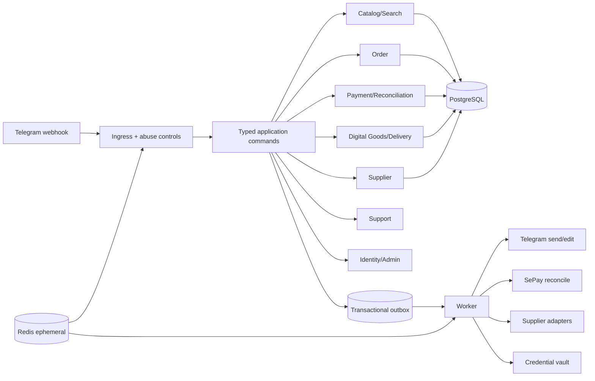

# Implementation Plan: Telegram Shop Digital MVP

> HISTORICAL SPEC. Mini App / WebApp / initData / shop.tier20.click: CANCELLED BY OWNER — DO NOT IMPLEMENT. Canonical architecture is Telegram-bot-only: `docs/architecture/telegram-only-commerce.md`.

**Branch**: `001-telegram-shop-mvp` | **Date**: 2026-07-16 | **Spec**: [spec.md](./spec.md)

**Input**: Feature specification from `specs/001-telegram-shop-mvp/spec.md`

## Summary

Build one TypeScript modular monolith plus worker for the customer journey `catalog/search ->
Buy Now -> VietQR -> verified SePay evidence -> local/supplier fulfillment -> view-once delivery`.
PostgreSQL and a transactional outbox are authoritative. Telegram, VietQR, SePay, vault, and
supplier integrations remain adapters around typed application commands. The first implementation
ends at a limited retail pilot; wallet, top-up, Reseller API, multi-item cart, and growth features
remain separate future specifications.

## Technical Context

**Language/Version**: Node.js 24 LTS + TypeScript 5.x in strict mode

**Primary Dependencies**: Fastify 5, grammY 1, Zod 4, Kysely 0.29, Pino 10,
OpenTelemetry API 1; BullMQ 5 only where Redis-backed work is justified

**Storage**: PostgreSQL for all authoritative state; Redis for ephemeral rate limits/cache/job
coordination; object storage for shop-owned media; approved vault/secret manager for credentials

**Testing**: Vitest 4, Testcontainers 12, fast-check 4, adapter contract fixtures, acceptance tests
at Telegram-update and SePay-webhook seams

**Target Platform**: Containerized Linux deployment behind TLS; Telegram webhook ingress

**Project Type**: Single backend application with an independently runnable worker from one codebase

**Performance Goals**: p95 useful bot response under 1 second for cached catalog/navigation;
SePay webhook validation/persistence acknowledgement under 1 second; healthy-dependency paid-to-
delivery p95 under 60 seconds

**Constraints**: Integer VND; `vi-VN`; `Asia/Ho_Chi_Minh`; one variant per Order; no raw
credential outside vault/delivery reveal; exactly-once business effects over at-least-once delivery;
sole numeric Telegram root admin; no policy bypass

**Scale/Scope**: Limited pilot baseline of 1,000 daily active customers, 20 concurrent checkouts,
10,000 catalog variants, and burst replay of 100 identical provider events; tune only from measured load

## Constitution Check

*GATE: design artifacts re-checked after the 2026-07-17 Gate 0 correction; implementation and
release gates remain REQUEST_CHANGES until the open production paths are proven.*

| Gate | Status | Evidence |
|---|---|---|
| Customer-first retail scope | PASS | Spec Out of Scope; no wallet/cart/reseller surface |
| VietQR initiation + verified SePay truth | PASS | FR-008–FR-012; payment contract |
| Exactly-once settlement/supplier/allocation/delivery | PASS | FR-010, FR-014–FR-017; idempotency keys in data model/contracts |
| Vault-only secrets | PASS | SR-001; Digital Asset and Delivery Bundle model |
| Sole numeric admin | PASS | FR-021–FR-023; Telegram command contract |
| Explicit state machines | PASS | data-model.md covers all state owners and guards |
| Contract-first external adapters | PASS | contracts/telegram-ux.md, payment-sepay.md, supplier-port.md, delivery.md |
| Test-first recovery and reconciliation | PASS | quickstart.md plus task ordering requirement |
| Policy and resale launch gates | PASS | SR-007–SR-008; activation and readiness gates |
| Critical/High design findings | DESIGN PASS | Revised Spec Kit analysis resolves G2-01 through G2-06 with T179–T190 ownership; implementation, staging, and release gates remain open and Feature 001 stays REQUEST_CHANGES |

### Post-design re-check

- Every external input has a validation, idempotency, timeout, error, and audit contract.
- No contract exposes raw credentials except the single-use authenticated reveal response.
- Database relationships preserve object ownership and unique business-effect keys.
- Recovery paths now specify missing webhooks, supplier unknown results, Bundle-before-handoff crash,
  vault-write/DB-rollback compensation, session expiry/rotation, and bounded capability cleanup.
- No constitution violation requires a complexity exception.

## Architecture



### Module ownership

| Module | Owns | Does not own |
|---|---|---|
| Identity/Admin | Customer/channel mapping, sole-admin policy, admin confirmations | Order/payment mutation |
| Catalog/Search | Category, Product, Variant, aliases, bounded search filters | Inventory claim, generated product facts |
| Commerce | Order snapshot and Order transitions | SePay verification, raw credential |
| Payments | Payment Intent, Bank Transaction, evidence, allocation, discrepancy, refund request | Fulfillment |
| Digital Goods | Asset lifecycle, reservation/claim, Delivery Bundle, replacement | Payment truth, supplier transport |
| Supplier | Supplier credential reference, SKU mapping, Supplier Order and reconciliation | Customer-facing facts, internal Order truth |
| Support | Ticket lifecycle and linked context | Mark-paid, direct refund, credential reveal |
| Risk/Ingress | Telegram/provider verification, dedupe, rate/body limits | Domain business decisions |
| Outbox/Worker | Reliable side-effect dispatch and retry/DLQ | Authoritative business state |

## Project Structure

### Documentation (this feature)

```text
specs/001-telegram-shop-mvp/
├── spec.md
├── plan.md
├── research.md
├── data-model.md
├── quickstart.md
├── contracts/
│   ├── application-commands.md
│   ├── delivery.md
│   ├── payment-sepay.md
│   ├── supplier-port.md
│   └── telegram-ux.md
├── checklists/
│   ├── requirements.md
│   ├── security.md
│   └── operations.md
├── analysis.md
└── tasks.md
```

### Source Code (repository root)

```text
src/
├── main.ts
├── worker.ts
├── config/
├── bot/
│   ├── webhook.ts
│   ├── callbacks.ts
│   ├── presenters/
│   └── middleware/
├── modules/
│   ├── identity/
│   ├── catalog/
│   ├── commerce/
│   ├── payments/
│   ├── digital-goods/
│   ├── supplier/
│   ├── support/
│   └── risk/
├── infrastructure/
│   ├── db/
│   ├── outbox/
│   ├── redis/
│   ├── vault/
│   └── observability/
└── shared/
    ├── errors/
    ├── ids/
    ├── money/
    └── time/

tests/
├── acceptance/
├── contract/
├── integration/
├── property/
├── security/
└── fixtures/
```

**Structure Decision**: One package and deployable codebase keeps transactions, ownership, and
operations simple. `main.ts` and `worker.ts` provide two process entrypoints without introducing
microservices. Each module exposes application commands/queries and owns its persistence mappings;
Telegram and provider adapters never import another module's persistence implementation.

## Delivery Phases

1. Walking skeleton: config, migrations, webhook ingress, command bus, outbox, observability.
2. Catalog/search: menu, category/product/variant read model, deterministic search, bounded parser.
3. Buy Now/payment: atomic pre-payment inventory reservation (reservation commits with the Order,
   before any Payment Intent), Order snapshot, VietQR presentation, durable SePay inbox, branded
   verified evidence, and reconciliation. Distinct SePay merchant identity vs VietQR beneficiary
   account number.
4. Fulfillment: local asset claim, deterministic active-hold re-entry, separate delivered history,
   supplier port/unknown recovery, vault, Delivery Bundle. `SUPPLIER_ONLY` remains hidden and
   payment-blocked until a later supplier-capacity hold/reconciliation/refund contract exists.
5. Customer recovery: Order history, support, discrepancy, replacement/refund request.
6. Owner operations: sole-admin controls, catalog kill switch, audits and runbooks.
7. Hardening/pilot: concurrency/replay/security/load/restore drills, Critical/High closure, launch sign-off.

## Complexity Tracking

No constitution violation or speculative abstraction is accepted. Redis/BullMQ remains optional;
the first implementation may use PostgreSQL outbox polling alone if pilot measurements do not
justify a second runtime dependency.

| Decision | Why simpler alternative rejected | Date |
|---|---|---|
| Pre-payment asset reservation in the Order transaction | Creating Payment Intent first and claiming after payment lets multiple customers pay for one final unit (P0 money-loss). Click-time arbitration is unfair under Telegram latency. | 2026-07-16 |
| Outbox fencing token on every ack/fail | Lease-only claim without owner/generation predicates lets a stale worker overwrite a reclaimer after lease expiry. | 2026-07-16 |
| Durable AdminConfirmation in PostgreSQL | In-memory confirmation Map loses high-risk actions across restart and creates a consume-before-apply crash window. | 2026-07-16 |
| Branded `VerifiedSePayEvidence` boundary | Accepting forgeable raw `PaymentEvidence` into settlement and writing `SIGNATURE_STATUS='VERIFIED'` fail-opens payment. | 2026-07-16 |
| Split SePay merchant identity vs VietQR beneficiary account | Collapsing both into one config value can render a QR that settles against a different matched account. | 2026-07-16 |
| Feature 001 supplier fail-closed allowlist | Minting a QR for `SUPPLIER_ONLY` without a pre-payment capacity hold can accept money for unavailable goods; hiding it is temporary while T143 and the future capacity contract remain open. | 2026-07-17 |
| `FOR SHARE OF v,p,c` for checkout revalidation | Buyer `FOR UPDATE` locks on shared product/category rows serialize unrelated variants. Shared row locks keep buyers compatible while still blocking concurrent admin update/deactivate until checkout commits. | 2026-07-17 |
| Transaction-level contention retry | Sleeping repeatedly inside a transaction holds catalog and pool resources. A single `SKIP LOCKED` probe per transaction plus bounded retry of the whole transaction preserves rollback recovery with bounded occupancy. | 2026-07-17 |
| Separate active-hold and delivered-history queries | One unordered query over `RESERVED|READY|DELIVERED` can re-deliver an old credential or attach a replacement case to the new asset. State-specific deterministic queries preserve both fulfillment and history. | 2026-07-17 |

## Follow-up review remediation (2026-07-16)

`remediation-review.md` reopened Feature 001 at `REQUEST_CHANGES`. Implementation MUST NOT treat
Phase 8 or partial Phase 9 checkmarks as pilot-ready. Required sequencing:

1. Spec Kit Gate 0 (this plan, updated `spec.md`/`data-model.md`/`tasks.md` Phase 10, checklists,
   analysis) reports zero Critical/High.
2. Reopen and remediate T154–T157: typed stock outcomes/presenter composition, finite TTL,
   supplier fail-closed surfaces/payment, deterministic replacement history, and compatible buyer
   locking with bounded contention/load evidence. Stop for review before T158.
3. Stable Buy Now nonce + `ON CONFLICT` paths only after the T154–T157 remediation review passes.
4. Production Telegram inbox/rate limit and SePay runtime verifier before claiming runtime readiness.
5. Outbox fencing + bounded recovery jobs before claiming exactly-once dispatch.

### Telegram durable-ingress clarification (T121/T126, 2026-07-17)

- Append-only migration order begins with `004_telegram_inbox.sql`; do not modify deployed
  `001_initial.sql`. Current Feature 001 migrations end at `008_sepay_inbox_security.sql`.
  Feature 001 identity/delivery upgrade MUST use `009_identity_delivery_security.sql`.
  Feature 003 MUST use `010_notifications_quantity.sql`, and Feature 002 MUST use
  `011_ai_support.sql`; no future feature may reuse an earlier prefix.
- PostgreSQL is authoritative for receipt, mutation detection, retry, leases, dead-letter state, and
  retention. The durable envelope is the allowlisted projection defined in `data-model.md`; raw
  Telegram JSON and free text are not stored.
- HTTP commits the envelope then acknowledges; bounded workers perform rate limiting and business
  dispatch. PostgreSQL provides the required atomic multi-instance rate-limit implementation and is
  the production fallback if Redis is unavailable; in-memory buckets remain explicit test/dev only.
- Inbox ownership and action budgets use database/server time and row locking. Production high-risk
  mutations fail closed; authenticated support and paid-Order recovery use distinct bounded lanes.
- Migration 008 is frozen as SePay-only. Migration 009 must upgrade both a SePay-only-008 database
  and a database produced by the prior expanded-008 snapshot. It normalizes `TELEGRAM`, fails
  closed on `telegram`/`TELEGRAM` collisions with a runbook, creates missing identity/delivery
  objects idempotently, and preserves existing rows.
- Bundle issue, handoff intent, capability storage, and notification retry form a recoverable state
  protocol. External vault I/O stays outside long PostgreSQL transactions. PREPARED/STORED/READY
  or equivalent compensation state plus bounded cleanup covers rollback, SENT, DEAD, and expiry.
- Delivery sessions use dedicated `DELIVERY_SESSION_HMAC_KEY`, key version, TTL, current/previous
  grace, idempotent refresh, and pre-send bundle/customer/chat claim matching. The customer transport
  is a Mini App that verifies Telegram `initData` before one-time redemption; a Telegram URL button
  is never assumed to attach an Authorization header.
- `actorUsername` is not persisted in the durable inbox. Root bootstrap uses numeric ID only; a real
  username observation may update metadata only from an authenticated Telegram webhook. The latest
  observation is cleared after 30 days without a newer verified observation by a bounded job.

### Gate 0 false-green correction (2026-07-18)

- Constitution v1.0.0 is unchanged: verified payment truth, least privilege, contract-first state
  machines, test-first recovery, and zero unresolved Critical/High design findings remain mandatory.
- External vault timeout ownership spans connect, response headers, streamed body read, size count,
  and parse. Request sizing uses the one serialized UTF-8 body that is actually sent. Redirects are
  disabled, endpoint userinfo/query/hash is rejected, and response bodies are finalized on every
  accepted/error path.
- Production vault endpoints require HTTPS and a fail-closed egress policy. The deployment chooses
  explicit host/port plus resolved-address allowlists so a private vault can be authorized without
  permitting metadata/link-local targets or DNS re-resolution outside the approved address set.
  Loopback HTTP exists only behind an explicit test transport injection and is not production config.
- Material and response-envelope limits are distinct so exact-maximum material can survive JSON
  encoding and reveal response wrapping. Chunked bodies without `Content-Length` are counted while
  streaming and cancelled at the first byte beyond the envelope limit.
- Delivery initial issue and refresh use deterministic operation identities. PREPARED sessions stay
  inactive until capability adoption, and their signing-key version is frozen so retry through the
  configured previous-key grace reproduces byte-identical material. Session creation, vault write,
  database swap, lease transfer, and old-ref deletion are individually recoverable. If both database
  swap and compensation delete fail, the orphan ref enters the additive 009a child ledger. Cleanup
  claims `PENDING -> DELETING` with owner/generation/lease, backs off failures, and serializes against
  adoption before reaching `CLEANED`; the cleanup lease exceeds the complete bounded external-vault
  delete retry budget.
- Notification send receives an `AbortSignal` and a bounded timeout strictly below the renewed
  30-second lease. Timeout remains retryable under the same durable idempotency key; the Telegram
  adapter owns ambiguous-send reconciliation before any subsequent create/send attempt.
- Delivery-session previous-key acceptance has an explicit grace-until timestamp independent of
  token expiry. Production notification processing requires session config and TTL; current and
  previous delivery keys are compared against Telegram, Buy Now, SePay, vault, and supplier secrets.
- Telegram username metadata composition is proven through the real webhook secret gate: rejected
  requests create neither durable inbox work nor username observation; only verified requests may
  enter the bounded observation path.
- Dependency order is A0 external-vault correction -> A1 crash/rotation correction -> HTTP supplier
  -> supplier fulfillment -> delivery invariants -> VietQR image/scan -> Telegram runtime -> compiled
  staging -> release evidence. T153 remains last.

6. External vault, HTTP supplier, signed delivery session, real Telegram notifier, QR image.
7. Production `migrate:prod` from `dist`, honest Docker skip/CI, SHA-bound evidence, independent
   review with zero Critical/High.

### Runtime evidence contract

- `npm start` / `npm run worker` MUST listen with real Telegram dispatcher and verified SePay route,
  not no-op / permanent 503 handlers.
- `migrate:prod` MUST execute the compiled artifact under `dist/` without requiring the `tsx`
  devDependency.
- Testcontainers suites MUST either run under a verified Docker service in CI or skip cleanly when
  the daemon is unavailable; a failed container start is not a pass, and a skip is not production
  evidence.
- Evidence under `specs/001-telegram-shop-mvp/evidence/` MUST bind to a valid git commit SHA and CI
  run once a valid repository exists.
- Until `.git` is valid, Docker/Testcontainers results are local proof only and MUST NOT be described
  as SHA-bound CI provenance. Production evidence MUST run the full suite on Node.js 24.

### A1 closeout checkpoint (2026-07-18)

- A1 closes T180/T181/T182/T187/T188 at the local-source gate after RED -> GREEN crash,
  lease/recipient, rotation, and cleanup proof plus independent zero-Critical/High re-review.
- Final A1 focused verification is 75/75 across eight files, run sequentially with real
  PostgreSQL/Testcontainers after recovering Docker Engine 29.2.1 from parallel host resource
  pressure. Static/build/security gates pass with 10 migrations and zero production vulnerabilities.
- Task truth is 172 checked / 15 open / 187. Overall Feature 001 remains REQUEST_CHANGES; T137/T143
  is next, while T153 remains last.
